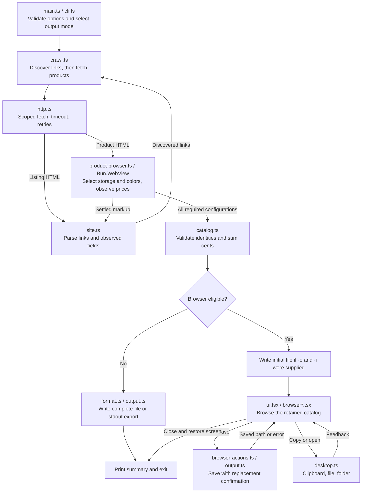

# Data flow

The [architecture guide](docs/architecture.md) maps modules and extension points. This diagram follows data and output decisions, not function calls.

An initial write failure ends the run; a browser action failure returns to the browser. Source and catalog failures occur before any export. [Effect finalizers](docs/effect.md#failure-and-cleanup) release resources on failure or cancellation before the CLI reports the outcome.
