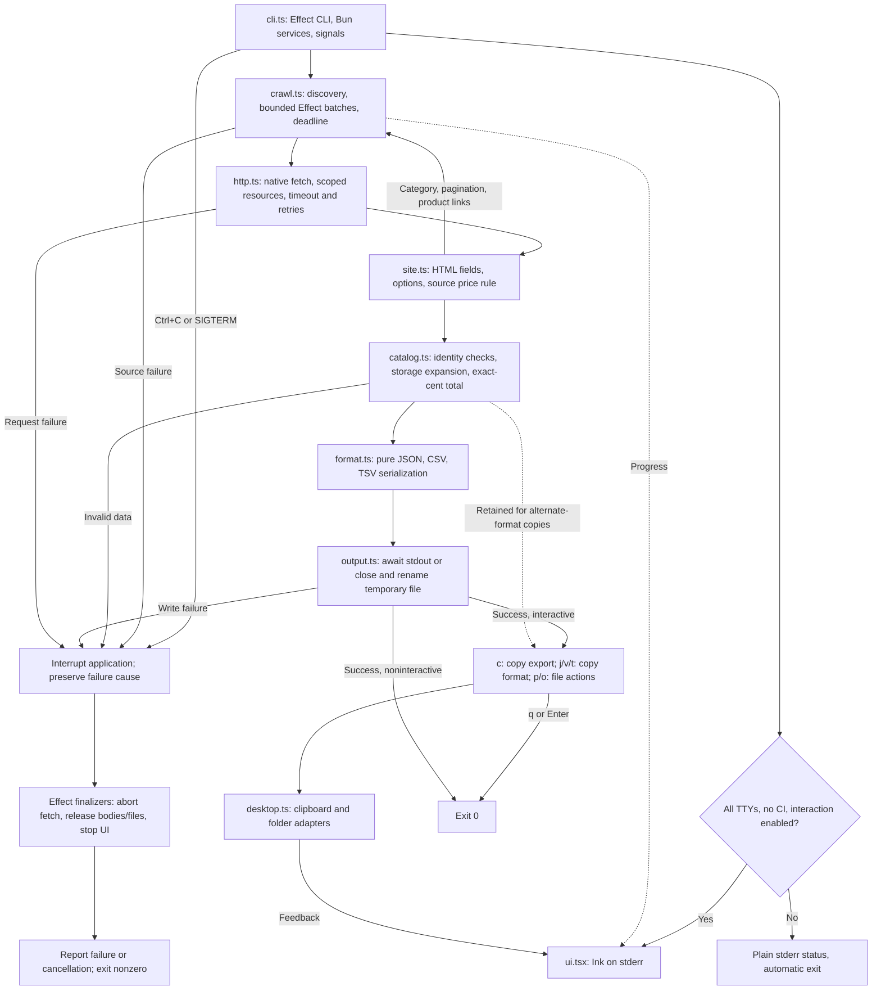

# Architecture

```mermaid
flowchart TD
    CLI["cli.ts: Effect CLI, Bun services, signals"] --> CRAWL["crawl.ts: discovery, bounded Effect batches, deadline"]
    CRAWL --> HTTP["http.ts: native fetch, scoped resources, timeout and retries"]
    HTTP --> PARSE["site.ts: HTML fields, options, source price rule"]
    PARSE -->|"Category, pagination, product links"| CRAWL
    PARSE --> CATALOG["catalog.ts: identity checks, storage expansion, exact-cent total"]
    CATALOG --> FORMAT["format.ts: pure JSON, CSV, TSV serialization"]
    FORMAT --> OUTPUT["output.ts: await stdout or close and rename temporary file"]
    CLI --> MODE{"All TTYs, no CI, interaction enabled?"}
    MODE -->|"Yes"| UI["ui.tsx: Ink on stderr"]
    MODE -->|"No"| PLAIN["Plain stderr status, automatic exit"]
    CRAWL -.->|"Progress"| UI
    OUTPUT -->|"Success, interactive"| ACTIONS["c: copy export; j/v/t: copy format; p/o: file actions"]
    CATALOG -.->|"Retained for alternate-format copies"| ACTIONS
    ACTIONS --> DESKTOP["desktop.ts: clipboard and folder adapters"]
    DESKTOP -->|"Feedback"| UI
    ACTIONS -->|"q or Enter"| EXIT["Exit 0"]
    OUTPUT -->|"Success, noninteractive"| EXIT
    CLI -->|"Ctrl+C or SIGTERM"| CLEANUP["Interrupt application; preserve failure cause"]
    CRAWL -->|"Source failure"| CLEANUP
    CATALOG -->|"Invalid data"| CLEANUP
    OUTPUT -->|"Write failure"| CLEANUP
    HTTP -->|"Request failure"| CLEANUP
    CLEANUP --> FINALIZE["Effect finalizers: abort fetch, release bodies/files, stop UI"]
    FINALIZE --> FAILED["Report failure or cancellation; exit nonzero"]
```
