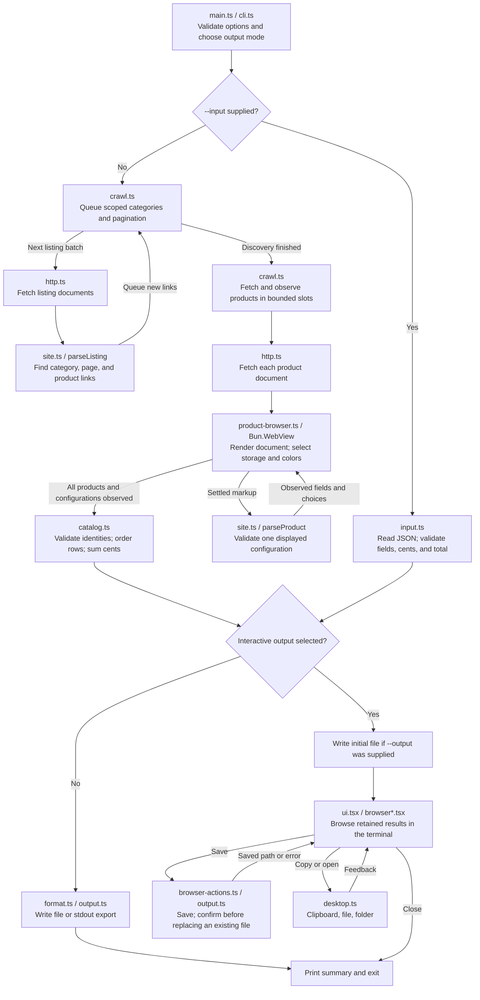

# Data flow

The [architecture guide](docs/architecture.md) maps modules and extension points. This diagram follows data and output decisions, not function calls.

The terminal mode is chosen during flag validation. For an interactive scrape, its progress screen starts before discovery; the result browser shown above appears only after the catalog and any initial file write succeed. With `--input`, validation finishes before the terminal starts. Importing makes no network requests and launches no extraction browser.

Listing discovery runs in batches. Product slots stay occupied as work finishes, so the next product need not wait for an entire batch. The default slot count is a CPU/RAM heuristic from one to six; `--concurrency` overrides it. These limits apply to crawler work, not every resource request made by Chrome.

HTTP supplies documents; it does not calculate configuration prices. The browser executes the page's own controls and reads their results. Same-origin scripts, styles, and pricing requests can run during those observations.

An initial write failure ends the run; a browser action failure returns to the browser. Source and catalog failures occur before any export. [Effect finalizers](docs/effect.md#failure-and-cleanup) release resources on failure or cancellation before the CLI reports the outcome.
