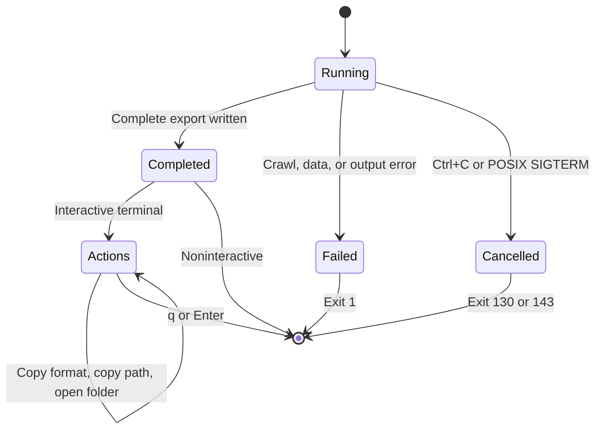

# Natter scraper

A TypeScript CLI for the [Web Scraper static e-commerce catalog](https://webscraper.io/test-sites/e-commerce/static). It follows categories and pagination, reads product detail pages, and exports every reachable product and enabled storage configuration as JSON, CSV, or TSV. JSON is the default assessment output.

## Run

To develop or run from source, use Bun **1.4.2**, pinned in `.bun-version`, `mise.toml`, and `package.json`. The install includes the project's TypeScript and lint tools. From the repository root:

```sh
bun install --frozen-lockfile

bun run check

bun run help
bun run scrape --output products.json --pretty
```

mise is optional. If you use it, run `mise trust` after reviewing `mise.toml`, then `mise install`. Prefix the commands above with `mise exec --` to select the pinned runtime explicitly.

End users can download a [standalone executable](https://github.com/exsesx/natter-scraper/releases) without installing Bun, Node.js, or the repository's dependencies. See [distribution](docs/distribution.md) for platform requirements and instructions. `bun run build` builds one for your current OS and architecture in `dist/`.

For a code review, `check` exercises local fixtures without crawling the public site. Start with the [CLI contract tests](tests/cli.test.ts), then [HTML extraction](src/site.ts) and [catalog construction](src/catalog.ts). The [module map](docs/architecture.md) explains the overall flow, and the [Effect walkthrough](docs/effect.md) explains failures and cleanup.

To pipe or redirect the JSON, with `jq` needed only for the first example:

```sh
bun run scrape | jq '.total'
bun run scrape --no-interactive > products.json
```

For spreadsheet exports:

```sh
bun run scrape --format csv --output products.csv
bun run scrape --format tsv --no-interactive > products.tsv
```

`--format` selects the format explicitly; filenames do not select it. `--pretty` applies only to JSON and is rejected with CSV or TSV.

The CLI targets the assigned catalog; it has no URL option. `--output -` also selects stdout. Progress and errors go to stderr. File mode leaves stdout empty and replaces the destination only after the complete result has been written to a temporary file in the same directory. The parent directory must exist. Shell redirection does not provide that file-preservation guarantee.

In a terminal, the running view becomes a completion screen after success. Press `c` to copy the exact exported text, `j` for JSON, `v` for CSV, or `t` for TSV. Copies use the completed catalog without fetching it again or changing the saved file. Press `p` to copy the saved file's absolute path, `o` to open its folder, or `q` or Enter to exit. File actions are available only after a successful file write.

All three streams must be TTYs for interaction. Pipes, redirected stdin/stdout/stderr, active CI, and `--no-interactive` exit automatically. A nonempty `CI` value activates CI mode unless it is `0` or `false`, case-insensitive. Desktop actions happen only on a keypress.



Exit codes are `0` for success/help, `1` for a scrape or write failure, `2` for invalid usage, `130` for Ctrl+C, and `143` for SIGTERM on macOS/Linux. Windows force termination does not provide the same graceful signal or cleanup guarantee. A failed crawl emits no partial catalog. A broken stdout pipe can leave bytes already written.

## Output

This small example is the output for the captured [Nokia product fixture](tests/fixtures/source/product-1.html), not a full live crawl:

```json
{
  "results": [
    {
      "name": "Nokia 123",
      "description": "7 day battery",
      "price": 24.99,
      "colors": ["Black", "Gold", "White"]
    }
  ],
  "total": 24.99
}
```

Storage choices produce separate names such as `Packard 255 G2 (128 GB)`, including when only one choice is enabled. Disabled choices are excluded, and configured products have no additional base result. Descriptions preserve source text apart from HTML decoding and whitespace normalization. `colors` appears only for at least two distinct selectable colors, without multiplying results by color.

Identity is the canonical product identity plus normalized storage choice, independent of names or prices. Identical duplicates collapse; conflicting duplicates fail. The total sums retained identities, so different products with equal prices both count. Arithmetic uses checked integer cents before encoding JSON numbers; unsupported precision or amounts that cannot retain cent precision fail. Results have a deterministic order, and JSON numbers need not preserve trailing zeros.

See [output.schema.json](output.schema.json) for the JSON shape.

CSV and TSV use the columns `name`, `description`, `price`, and `colors`, with one header and one row per result. Prices have two decimal places. Colors share one cell separated by `; `; missing colors leave it empty. These formats omit a total row so every data row remains a product; the total still appears in the stderr or terminal summary. Use JSON when you need the nested array structure and total in one document.

Both delimited formats use UTF-8 without a BOM, CRLF record endings, quoted cells for delimiters or line breaks, and doubled embedded quotes. TSV uses the same quoting rules with a tab delimiter. Text cells with formula-like prefixes receive a leading apostrophe; numeric prices stay numeric. This is a precaution for direct spreadsheet import, not a guarantee across spreadsheet applications or later save/reopen operations. JSON preserves the original text. See [CSV quoting](https://www.rfc-editor.org/rfc/rfc4180) and [spreadsheet formula handling](https://owasp.org/www-community/attacks/CSV_Injection).

## Develop and verify

```sh
bun run check
bun run test
bun run typecheck
bun run lint
bun run format

bun run test:terminal

bun run build
bun run test:binary
```

`check` runs type checking, linting, and tests. Tests use captured HTML, synthetic edge cases, and loopback HTTP servers. They do not crawl the public site or change the clipboard.

`test:terminal` uses Bun's terminal API to exercise actual input, resize, cancellation, and completion actions against fixtures. `test:binary` verifies the compiled application and its terminal path. Both use mocked desktop actions, so they do not change the clipboard or open folders. No Python installation is required. See [distribution and platform checks](docs/distribution.md) for commands, target names, and the Windows verification limits.

[CI](.github/workflows/check.yml) runs these checks and produces native build artifacts for macOS, Linux, and Windows on x64 and arm64. See [workflow runs](https://github.com/exsesx/natter-scraper/actions/workflows/check.yml) for results at a specific commit.

The toolchain pins Bun **1.4.2** and TypeScript **7.0.2**. Direct production and development dependencies were checked against the latest stable npm tags on September 18, 2026, with one intentional exception: `effect` and `@effect/platform-bun` both use **4.0.0-rc.115**, an Effect v4 release candidate. Keep those two versions aligned when upgrading; `effect/unstable/cli` is also explicitly an unstable API. Exact versions are in [package.json](package.json) and resolved dependencies are in `bun.lock`.

Effect owns application sequencing, typed failures, bounded concurrent work, retry schedules, and cleanup on cancellation. Its CLI module defines flags, validates arguments, and generates help. Cheerio reads HTML, and Ink renders the terminal view. The HTTP adapter wraps native Bun `fetch`; it does not add a browser or a second HTTP client.

Read the [architecture and module map](docs/architecture.md), the [Effect walkthrough](docs/effect.md), and the [Mermaid data-flow diagram](ARCHITECTURE.md). Before changing extraction or prices, read the [dated source evidence](docs/source-behavior.md).

Agent guidance is in [AGENTS.md](AGENTS.md), including Git conventions and how the shared instructions work in checkouts without symlink support. The bundled [verification guide](.agents/skills/verify-scraper/SKILL.md) can be read as Markdown by any developer or agent. No agent application, external skill, or plugin is required to run or contribute to the scraper.

In Codex, invoke the guide explicitly with `$verify-scraper verify my CSV changes before I commit`. Codex discovers the repository skill and can also select it when a task matches its description; `AGENTS.md` directs relevant verification to the same guide. Selection happens during an agent task, not on every file save or commit. See [Codex skill invocation](https://learn.chatgpt.com/docs/build-skills). Developers working without an agent can run the package scripts above directly.

## Assumptions and limits

Coverage means all pages reachable through the target's category, pagination, and product links. The crawler restricts requests and redirects to that origin and subtree. Defaults are two concurrent requests, a 15-second request timeout, a five-minute run deadline, and at most two retries for transient failures. It caps HTML at 2 MiB per response and discovery at 10,000 URLs.

Storage prices use the site's observed JavaScript rule, verified against representative browser selections. The scraper does not execute or revalidate that script on every run. A pricing-script change with unchanged HTML can therefore require a parser update. Unknown controls, unsupported prices, missing required fields, conflicting identities, and empty results fail explicitly. Dated fixtures are regression evidence, not a promise that the live site will remain unchanged.

Terminal checks use mocked desktop actions; they do not establish actual clipboard/folder integration. Linux binaries target glibc, not musl. Optional desktop actions need the [platform's clipboard and folder helpers](docs/distribution.md#desktop-actions). See [platform verification](docs/distribution.md#verify-on-the-target-platform) for Windows cancellation and console-mode limitations.

Cancelling an Effect interrupts the scraper's work and runs its cleanup when the process receives a supported cancellation event. It cannot undo a clipboard write or folder-opening request already handed to the desktop helper. A force-killed process cannot run cleanup.

AI agents assisted with implementation, tests, source inspection, and documentation. The repository contains no private recruitment correspondence.
