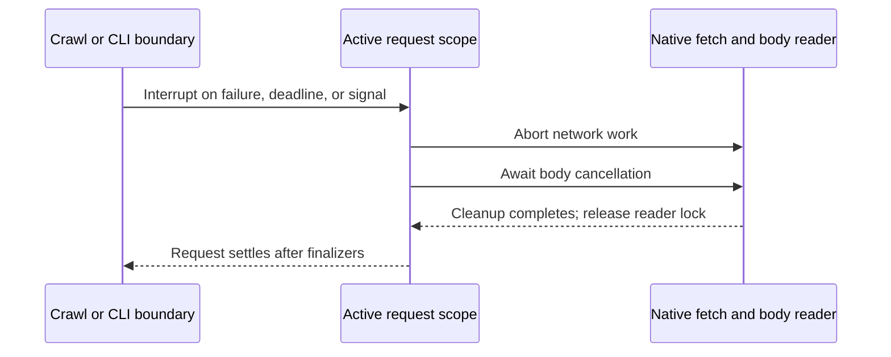

# Effect in this scraper

The application uses Effect v4 **4.0.0-rc.115** and the matching `@effect/platform-bun` release candidate. The CLI imports `effect/unstable/cli`. These are intentional prerelease choices, pinned together in [package.json](../package.json); consult the installed v4 API when changing them.

## Follow one run

[`runCli`](../src/cli.ts) returns an `Effect<number>` whose result is the process exit code. The executable runs that Effect once with `Effect.runPromise`. `Command` and `Flag` define the existing command-line interface, and `BunServices.layer` supplies its platform services. Buffered help keeps invalid usage on stderr and explicit `--help` on stdout.

The main sequence is crawl, validate, serialize, write, then show completion. Inside `Effect.gen`, `yield*` runs the next Effect and stops that sequence on failure. For example, [`crawl`](../src/crawl.ts) returns `Effect<CrawlResult, CrawlError>`: callers receive a catalog or a typed failure, without starting an independent promise chain.

Discovery and product fetching use bounded `Effect.forEach` batches. [`requestHtml`](../src/http.ts) owns native `fetch`, redirects, response validation, and body reads. `Effect.timeoutOrElse` bounds an attempt; an exponential `Schedule` retries eligible failures and waits at least as long as `Retry-After` requests. The separate crawl deadline includes retry waits.

## Failure and cleanup

Each request attempt creates an abort controller. Response and reader scopes register cleanup for each redirect; the pending-fetch adapter also waits for an interrupted fetch to settle. On failure or interruption, it aborts network work, awaits body cancellation, and releases the reader lock. A failing batch interrupts its siblings and waits for their finalizers before settling.

Expected errors are tagged with `Data.TaggedError`. These errors are yieldable in v4, so validators can use `return yield* invalid(message)`. The small `invalid` functions construct the domain error and retain its source context; they do not throw or catch defects. `RequestFailure` retains the URL, attempt count, and underlying `HTTP`, `Transport`, `RequestTimeout`, or `InvalidResponse` cause. Source parsing uses `ExtractionError`; money and identity validation use `CatalogError`. A synchronous exception from an injected fetch adapter is a defect and is not retried as a transport failure.

[`writeResult`](../src/output.ts) uses `Effect.acquireUseRelease` to open, write, and close the temporary file. Its release can report a typed close error alongside a write failure without separate mutable error state. It then performs the rename without interruption between starting that operation and observing its result. An exit finalizer removes the owned temporary file when it remains. This provides atomic replacement through a same-directory rename. Stdout uses a write callback to wait for completion and handle backpressure; already-written bytes cannot be rolled back.

The CLI races application work against cancellation and leaves its scopes before applying the exit code. Ctrl+C exits with code 130. On macOS/Linux, SIGTERM follows the same cleanup path and exits with code 143. Windows force termination does not deliver the equivalent graceful signal, so it cannot guarantee these finalizers run.

Ink is acquired only for an interactive run. React input handlers are a separate runtime boundary for completion actions. Shutdown joins the active action and any retiring renderer before completing; renderer teardown failures propagate to the CLI. Their Effect fibers can be interrupted, but the clipboard and folder helpers expose promises without an abort contract. Cancellation cannot guarantee stopping or reversing an external desktop action.

## Why native adapters remain

The pinned platform adapters do not remove the guarantees implemented here. The fetch adapter must await aborted native work, validate every redirect before following it, and enforce the body-size limit while reading. File output must preserve close failures in its typed error channel and combine them with a primary write failure. Replacing these adapters with the corresponding platform APIs in `4.0.0-rc.115` would require extra wrappers to retain those behaviors. Reassess this choice against these requirements when upgrading Effect.

## Change and test

Keep site rules in `site.ts` and catalog rules in `catalog.ts`; neither needs a service layer to use Effect. Pure helpers, including `serializeCatalog`, remain ordinary functions. Reserve Effects for typed failures, asynchronous work, and resource ownership. The HTTP test seam is an injected fetch function, and desktop tests inject the clipboard/folder functions. Start runtime execution at the CLI, tests, or React callback boundary, rather than inside parsing or crawling helpers.

Tests use `Effect.runPromise` for returned values and `Effect.runPromiseExit` when inspecting tagged errors or defects. [Crawl tests](../tests/crawl.test.ts) cover retry counts, deadlines, sibling interruption, and delayed body cleanup. [Output tests](../tests/output.test.ts) cover file preservation, temporary cleanup, and blocked writes. Run `bun run check`; use the [terminal verification command](../README.md#develop-and-verify) when changing UI or signal handling.

Standalone builds execute the same Effect entry point. `bun run test:binary` checks the compiled application and its terminal behavior with fixtures. See [distribution](distribution.md#verify-on-the-target-platform) for native target checks and the limits of Windows cancellation verification.
