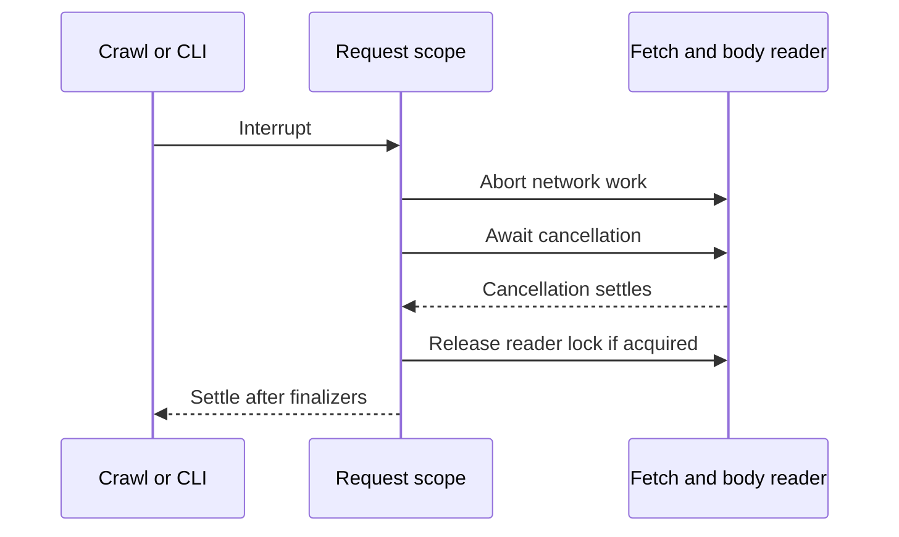

# Effect in this scraper

[package.json](../package.json) pins Effect v4 and `@effect/platform-bun` to `4.0.0-rc.115`. The CLI uses `effect/unstable/cli`. These are prerelease APIs; check the installed version when changing them.

## Follow one run

[`main.ts`](../src/main.ts) runs [`runCli`](../src/cli.ts) once with `Effect.runPromise`. `runCli` returns an `Effect<number>` containing the exit code. `BunServices.layer` supplies CLI platform services.

Inside `Effect.gen`, `yield*` runs an Effect and stops the sequence on failure. A minimal direct export looks like this:

```ts
const exportCatalog = Effect.gen(function* () {
  const result = yield* crawl();

  yield* writeResult(serializeCatalog(result.catalog));
});
```

The actual CLI adds flag validation, terminal handling, and signals. [`crawl`](../src/crawl.ts) returns `Effect<CrawlResult, CrawlError>`, after bounded discovery and product observation. Product work uses one `Effect.forEach` over the discovered URLs, with bounded concurrency, so finishing a product immediately frees its slot for the next URL. [`requestHtml`](../src/http.ts) owns each fetch attempt. Its timeout covers redirects and body reads; retries wait for the longer of exponential backoff and `Retry-After`. The crawl deadline includes retry waits. Finalizer cleanup can extend elapsed time beyond either deadline.

Expected failures use yieldable `Data.TaggedError` types. `RequestFailure` retains the URL, attempt count, and underlying `HTTP`, `Transport`, `RequestTimeout`, or `InvalidResponse` error. Parsing uses `ExtractionError`; catalog validation uses `CatalogError`. Unexpected exceptions remain defects. In particular, a synchronously throwing injected fetch adapter is not retried as a transport failure.

## Failure and cleanup

Each attempt owns an abort controller. Each response and body reader has a scope. Redirect responses close before the next request, and interruption waits for pending fetch and body cleanup. A failed request or product observation interrupts its siblings and waits for their finalizers.

`createProductReader` requires an Effect scope and registers a finalizer for every view it creates. Each `Effect.tryPromise` observation leases an idle view or creates one. A successful read ends the document and detaches its listeners before returning the view for reuse. A temporary new-document script clears tab-local state before the next product's scripts run, then removes itself before storage-choice reloads. The callback's abort signal and operation timeouts close the active view; failed reads discard it. The crawl scope closes all remaining views on every exit path. The adapter never attaches to the user's running browser or calls the process-wide `closeAll()` API. Each storage choice is observed afresh; there is no inferred price table.



[`writeResult`](../src/output.ts) uses `Effect.acquireUseRelease` to open, write, and close a temporary file. A close failure can accompany a write failure in the typed error cause. Publication is uninterruptible, so cancellation cannot stop between starting rename/link and observing its result. An exit finalizer removes the temporary filename. The [architecture guide](architecture.md#data-and-output) explains overwrite and stdout guarantees.

The CLI races work against cancellation and leaves its scopes before applying the exit code. Ctrl+C exits 130; POSIX SIGTERM exits 143. Windows force termination cannot guarantee cleanup.

React callbacks start separate action fibers. Shutdown interrupts and joins the active action, restores the terminal, then permits the completion summary. Renderer teardown failures reach the CLI. Desktop helpers expose promises without an abort contract, so interruption cannot guarantee stopping or undoing a clipboard or file-opening action.

## Changing the code

Keep snapshot parsing in `site.ts`, option interaction in `product-browser.ts`, catalog rules in `catalog.ts`, and pure serialization in `format.ts`. The browser promise adapter runs the pure parsing Effect when it receives settled markup; other runtime entry points are CLI startup, tests, and React callbacks. HTTP and file adapters remain native to preserve explicit redirect validation, awaited fetch cancellation, and typed file-close failures. Preserve those behaviors if replacing them with platform services.

Tests use `Effect.runPromise` for values and `Effect.runPromiseExit` for errors or defects. [Crawl tests](../tests/crawl.test.ts) cover retries, deadlines, sibling interruption, and delayed cleanup; [output tests](../tests/output.test.ts) cover file preservation and blocked writes. Run `bun run check`. UI or signal changes also require [terminal verification](../README.md#develop-and-verify); [standalone verification](distribution.md#verify-on-the-target-platform) exercises the same entry point after compilation.
